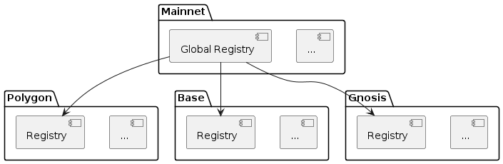
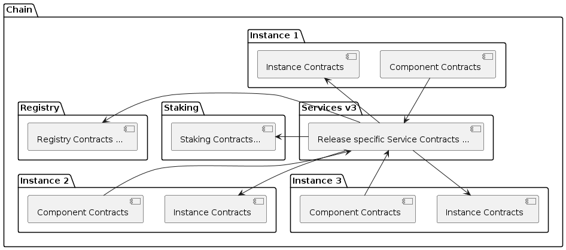

= Architecture

NOTE: This document is under construction

== Introduction

=== Decentralized Insurance Protocol (DIP)

The Decentralized Insurance Protocol (DIP) enables the creation and management of decentralized insurance products. The protocol is designed to be flexible and extensible, allowing for the creation of a wide range of insurance products. 

The protocol supports a multi-chain ecosystem to let users choose the chain that best fits their needs. The protocol is designed to be chain agnostic, allowing for the deployment of the protocol on any EVM compatible chain.

=== Generalized Insurance Framework (GIF)

The Generalized Insurance Framework (GIF) is a set of smart contracts that implement the Decentralized Insurance Protocol (DIP). 
The main Goal of the GIF is to support its users in creating and managing decentralized insurance products as efficitiently and safe as possible. 

GIF users should be able to focus on their use case specific business logic.
GIF takes care of the use case independent heavy lifting like managing policies, claims, payouts, managing collateral in pools, etc.

The GIF itself is a highly modularized and flexible infrastructure that can be deployed to any EVM compatible chain.
Most contracts of the GIF will already be deployed and are ready to be used by the users.

== GIF Multi-Chain Setup

=== Overview

For each supported chain a chain specific GIF setup is deployed.
To link all chains together a global registry is deployed on mainnet.
This global registry then holds the links to all chain specific registries as shown in the diagram below.

=== Global Registry

The global registry is deployed on mainnet can be understood as the directory and entry point for the complete protocol ecosystem. 

The global registry contains entries for all protocol relevant objects on mainnet and a chain registry entry for each supported chain in the ecosystem.
At the same time the global registy plays the role of the mainnet chain registry.

=== Chain Registries

On each chain supported by the protocol a chain registry is deployed.
A chain registry contains entries for all protocol relevant objects on that specific chain.
These entries hold basic metadata of the object and are backed by an NFT that defines the ownership of the object.

The list below provides the basic metadata for each object in the registry:

* NFT ID: A protocol unique ID
* Parent NFT ID: A pointer to the parent object in the registry
* Object Type: The type of the object (registry, service, instance, product, policy, etc)
* Object Address: The contract address for contract objects

=== Protocol Objects

The following objects are managed by the protocol:

* Protocol: The object representing the protocol itself
* Registry: Registry contracts
* Instance: Instance contracts linked to the chain registry
* Product: Product contracts linked to an instance
* Policy: Policy object linked to a product contract
* Distribution: Distribution contracts linked to an instance
* Distributor: Distributor object linked to a distribution contract
* Oracle: Oracle contracts linked to an instance
* Pool: Pool contracts linked to an instance
* Bundle: Bundle object linked to a pool contract
* Staking: Staking contracts linked to the chain registry
* Stake: Stake object linked to its target object (instance or protocol)

== GIF Single-Chain Setup

=== Overview

=== Registry

=== Services

=== Instance

=== Components

==== Product

==== Distribution

==== Oracle

==== Pool

=== Staking

== GIF Release Mangement

=== Releases

- GIF releases use semantic versioning with major, minor and patch releases
- For GIF major releases a new master instance and a set of upgradeable service contracts are deployed
- Smart contract upgradeability is only used for minor and patch releases for a specific major release
- The GIF registry contract is non-upgradeable and built to be able to handle multiple major releases
- Most instance contracts are non-upgradeable and hard wired to a specific major release

=== Registry

- Registry registers all relevant and ownable GIF objects like instances, products, policies, etc on a specific chain
- The global registry on mainnet also contains entries for the chain registries on other chains
- Registry access is granted through the `RegistryAdmin`
- Registry contracts are non-upgradeable
- Registry should be able to cope with multiple major version upgrades. 
- Transactional operations (writing) to the registry are done via the `RegistryService`
- Registry is owned by the protocol owner

=== Services

- Service contracts are upgradeable
- Service contracts may be upgraded for minor and patch updates
- Service contracts may not be upgraded for major updates. 
- For major GIF upgrades a new service contract needs to be deployed and registered
- Services are maintained and upgraded by the protocol owner
- Service ownership/maintenance may be delegated to specific service owners in the future

=== Instance

- Instance contracts are non upgradable
- Instance contracts support minor and patch updates of services
- Instance contracts do not support major updates of services
- New instances are created by the instancer owner calling `InstanceService.createInstance`
- Transactional operations (writing) are only via services
- Read access to the instance is done through the `InstanceReader` and/or services
- Every instance has its own `AuthorizationManager` for managing authorizations
- Authorization is managed by the instance owner
- GIF provides default set of authorizations when cloning the instance
- Instances are not upgradable

=== Component

- Components are built and deployed by the component owners (which are not the same as the protocol owner)
- Components interact with the instance through the services
- Components are bound to a fixed major version of a service
  Patch/Minor version upgrades of a service will be done by the protocol owner and will be completely transparent to the component owner
  Major version upgrades will require a new component version to be deployed by the component owner
- End users (consumers) interact with the system through components
- Components must provide all necessary functions for consumer interaction 
- Components use the instance's `AuthorizationManager` for authorization checks

=== Staking

- Keep track of total value locked (TVL) per instance
- TVL: amount of tokens locked by active policies
- Creating policies increase TVL, executing payouts and closing policies decrease TVL
- TVL in USD may be calculated using price feeds or CEX/DEX exchange rates
- Staking will initially be supported on instance level (bundle staking too fine grained)
- A corresponding amount of DIP token shall be staked using a staking rate
- For the tracking of TVL and related DIP stakes a global dashboard will be provided

Open staking questions

- minimal staking period? eg 3 months 
- minimal staking extensino period? eg 3 months
- slashing? not initially
- upgradeability? likely yes
