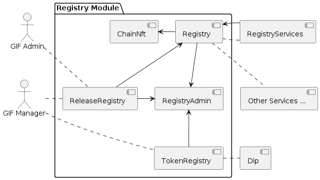
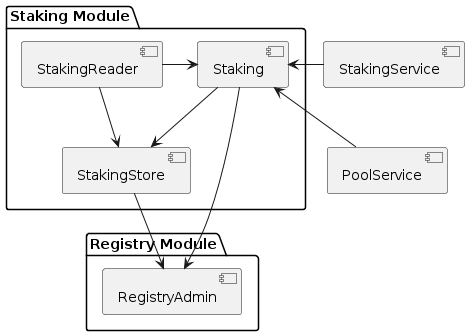

= Architecture

== Introduction

=== Decentralized Insurance Protocol (DIP)

The Decentralized Insurance Protocol (DIP) enables the creation and management of decentralized insurance products. The protocol is designed to be flexible and extensible, allowing for the creation of a wide range of insurance products. 

The protocol supports a multi-chain ecosystem to let users choose the chain that best fits their needs. The protocol is designed to be chain agnostic, allowing for the deployment of the protocol on any EVM compatible chain.

=== Generalized Insurance Framework (GIF)

The Generalized Insurance Framework (GIF) is a set of smart contracts that implement the Decentralized Insurance Protocol (DIP). 
The main Goal of the GIF is to support its users in creating and managing decentralized insurance products as efficitiently and safe as possible. 

GIF users should be able to focus on their use case specific business logic.
GIF takes care of the use case independent heavy lifting like managing policies, claims, payouts, managing collateral in pools, etc.

The GIF itself is a highly modularized and flexible infrastructure that can be deployed to any EVM compatible chain.
Most contracts of the GIF will already be deployed and are ready to be used by the users.

== Multi-Chain Setup

=== Overview

For each supported chain a chain specific GIF setup is deployed.
To link all chains together a global registry is deployed on mainnet.
This global registry then holds the links to all chain specific registries as shown in the diagram below.

image::./images/multi-chain-setup.png[Multi-chain setup]

=== Global Registry

The global registry is deployed on mainnet can be understood as the directory and entry point for the complete protocol ecosystem. 

The global registry contains entries for all protocol relevant objects on mainnet and a chain registry entry for each supported chain in the ecosystem.
At the same time the global registy plays the role of the mainnet chain registry.

=== Chain Registries

On each chain supported by the protocol a chain registry is deployed.
A chain registry contains entries for all protocol relevant objects on that specific chain.
These entries hold basic metadata of the object and are backed by an NFT that defines the ownership of the object.

The list below provides the basic metadata for each object in the registry:

* NFT ID: A protocol unique ID
* Parent NFT ID: A pointer to the parent object in the registry
* Object Type: The type of the object (registry, service, instance, product, policy, etc)
* Object Address: The contract address for contract objects

=== Protocol Objects

The following objects are managed by the protocol:

[cols="1,3"]
|===
|Object |Comments

|Protocol |The object representing the protocol itself
|Registry |Registry contracts
|Instance |Instance contracts linked to the chain registry
|Product |Product contracts linked to an instance
|Policy |Policy object linked to a product contract
|Distribution |Distribution contracts linked to an instance
|Distributor |Distributor object linked to a distribution contract
|Oracle |Oracle contracts linked to an instance
|Pool |Pool contracts linked to an instance
|Bundle |Bundle object linked to a pool contract
|Staking |Staking contracts linked to the chain registry
|Stake |Stake object linked to its target object (instance or protocol)
|===

== Single-Chain Setup

=== Overview

The GIF setup on any specific chain always consists of a registry and staking modules, services and instances as shown in the diagram below.

image::./images/single-chain-setup.png[Single-chain setup]

=== Registry

Registries have already been introduced in the text above.
As already mentioned a registry is the central entry point for all protocol objects on a specific chain.

=== Staking

The staking module is used to manage the DIP that are staked by users to either the protocol itself or to an instance that is registered as a staking target.

=== Instance

Instances are used by ecosystem participants to create and operate actual use cases/products.
Instances consist of a set of instance contracts and a number of so-called components that are required to implement an actual use cases. 

=== Components

Currently, products, distributions, oracles, and pools as supported by GIF as component types.

=== Services

Services are used to implement the generic insurance business logic of the GIF.
Components, instances, the registry and the staking module may only interact with each other through these generic service contracts.

== Modules and Services

=== Overview

=== Modules

Modules are defined as a set of contracts that serve a specific purpose.
Each contract in a module has its clear role and responsibility and interacts with other contracts in the module to fulfill its purpose.
Contracts in the same module may directly interact with each other without the need to go over a service contract.

Examples of modules are the registry module, the staking module, and instance modules.

=== Services

Services have a domain scope such as "Registry" or "Policy" and implement the domain specific business logic.
Services are stateless and only operate on the state of the involved module contracts.
Service contract may also interact with other service contracts.

Even though the service contracts are upgradeable, only non breaking changes are ever allowed inside a specific major release.

=== Registry Module

The registry module diagram below provides an overview of the registry related contracts of a GIF deployment.

Contracts and their responsibilities are outlined below.

[cols="1,3"]
|===
| Contract | Responsibility

| GIF Admin
| Account with the GIF Admin role initiates and confirms new GIF releases.

| GIF Manager
| Deployes and registers service contracts of new GIF releases.
Manages token white listing.

| ChainNft
| Mints and manages all NFTs related to the objects stored in the registry.
Only the registry contract may call state changing functions on this contract.

| Registry
| Stores entries for all protocol relevant objects on this chain.

| ReleaseRegistry
| Keeps track of all deployed major releases so far.
Manages deployment of new releases.

| TokenRegistry
| Manages whitelisting of supported ERC20 tokens per major release.

| RegistryAdmin
| Central authorization for all core contracts (resistry module and staking module) and all service contracts from all major releases.

| RegistryService
| A registry service contract from a specific GIF release.
Registry service contracts are authoriezd to register new objects with the registry.

| Other Services
| TODO remove this component also remove dashed line beween registry and registry service.

| Dip
| The DIP token deployed outside of the GIF deployment.
The DIP token is always registered with the Token registry.

|===

=== Staking Module

The staking module diagram below provides an overview of the registry related contracts of a GIF deployment.

[cols="1,3"]
|===
| Contract | Responsibility

| StakingReader
| Provides all read access functions to staking related data.

| StakingStore
| Stores all staking related data like staked DIPs per staker and target, available staking targets, total locked value per target staked DIPs per target.

| Staking
| The central staking contract that implements to upgradeable business logic for staking.

| StakingService
| A release specific service contract that is authorized to create new stakes and manage existing stakes.

| PoolService
| Informs the staking contract about changes in the total locked value (TVL) amounts of the instances.

| RegistryAdmin
| Manages the authorization for all contracts in the staking module.

|===

== Authorization

=== Overview

Autorization is a key concept in the GIF.
Authorization is organized per supported chain and implemented in access admin contracts using role based access control.
Role based access control involves roles, targets and functions level authorization.

Roles can be considered as lables or IDs that can be assigned (granted) to accounts or removed (revoked) from accounts.
*Accounts* can either be externally owned accounts or contract accounts.
The set of accounts that have a specific role is called the role members.

The term *Targets* is used for contracts for which function level authorization is managed by an access admin contract.
That particular access admin contract is then called the authority of the target contract.

*Function Level Authorization* defines which fuctions of a target may be executed through which role.
For each authorized function of a target the required role to access it is defined.
Only a single role can be specified per function and only members of that role (both contracts and externally owned accounts) may then execute the function.

=== Access Admin

Access admin contracts manage explicit lists of named targets, roles and functions that are granted to these roles.
It also provides view functions that allow to enumerate all available roles, current role members and all granted functions for every managed target.

The implementation of the access admin contract is based on OpenZeppelin's `AccessManagerUpgradeable` and `AccessManagedUpgradeable` contracts.

The access admin contract extends the OpenZeppelin functionality by providing named roles, targets and functions and by providing the capability to enumerate all current role members and all granted functions for every managed target.

The access admin contract is the base contract for two specialized admin contracts.
Per supported chain there is a registry admin contract and for each instance there is an instance admin contract.

=== Registry Admin

The registry admin contract is the central contract that controls access to the registry, to staking as well as interactions between service contracts.

In the case of services the registry admin maintains access to service functions per major release in the sense that a service of a specific major release may only interact with services of the same major release.

=== Instance Admin

For each instance an individual instance admin contract exits.
This instance admin is used to manage authorizations for the interactions between the instance and all its linked components with all linked services.

=== Upgrading Contracts

Authorization for upgrading upgradeable contracts is a special case.
Every upgradeable contract in GIF comes with its own proxy manager contract.
Only this proxy manager contract may be used to upgrade an upgradeable contract.
And only the owner of an upgradeable contract may execute an upgrade via this proxy manager contract.

The ownership of an GIF relevant upgradeable contract is defined via its NFT as recorded in the chain registry.

Upgradeability relies on OpenZeppelin's `TransparentUpgradeableProxy` and `ProxyAdmin` contracts.

== Release Management

=== Overview

GIF releases follow semantic versioning, which includes major, minor, and patch releases. 
The major version number is incremented whenever there are breaking changes that could potentially disrupt existing functionality or compatibility.

For every major releases, a consistent set of upgradeable service contracts are deployed and registered with the registry. 
For non-breaking changes the existing service contracts are upgraded in place.
The staking module is independently upgradeable and may be upgraded at any time.
The registry module is non-upgradeable and is capable of serving multiple major releases simultaneously.
Instance modules are non-upgradeable and directly linked to the service contracts of the same major release.

Adding a new major release is guarded by role based authorization including two roles, a GIF Admin role and the GIF Manager role.

=== Core Deployment

The core deployment sets up the registry and the staking modules and includes all the wiring between the contracts needed for actual relese deployment.
For each supported chain a core deployment is the required first step.

For the registry module deployments the contracts Registry, ChainNft, TokenRegistry, and RegistryAdmin are deployed and initialized.
Where neceesary these contracts are linked to the registry admin contract that manages all authorization for both the registry and the staking module.

On mainnet the *Regsitry* contract is deployed and initialized with two entries, one for the protocol object and one for global registry.
On any other chain the initial setup includes an additional entry for the chain registry.

The registry istelf deployes the *ChainNFT* contract that will hold NFT representations of all protocol relevant objects on this chain.

The *TokenRegistry* is deployed and initialized with the DIP token as staking token.

The *RegistryAdmin* contract is deployed intialized with the GIF Admin role and the GIF Manager role.

* The necessary authorizations are put in place to allow the GIF Admin and GIF Manager roles to deploy the first major release.
* For the whitelisting of tokens the GIF Manager role is granted the necessary authorizations.
* For release deployment the release registry contract is authorized to register new service contracts with the registry.
* Regstry services (for all releases) are granted access to register objects with the registry contract.
* Staking services (for all releases) are granted access to the staking contract.
* Pool services (for all releases) are granted access to the staking contract to update the total value locked in instances.s

For the staking module deployment the contracts StakingReader, StakingStore, StakingManager and Staking are deployed and initialized.
The staking contract is also registerd with the registry.

=== Release Deployment

The release deployment is the second and final GIF deployment step to a specific chain.
For each supported chain a release deployment is required.
A release deployment to a new chain will only include the deployment of the latest major release.
Initially this will be the GIF v3 release.
In the future new major releases should be deployed on all chains that are actively supported by the protocol.

A release deployment consist of the deployment and authorization of a release specific and consistent set of service contracts.
As the service authorization is restricted to other services of the same release, services are assigned release specific roles.
Service authorization is managed by the registry admin contract and defines which service fuction may be called by which other service.

The process of a release deployment invlovles the GIF Admin and the GIF Manager roles.
The GIF Admin role represents the principal owner of the protocol and GIF Manager role is the role that is authorized to deploy and register the service contracts with the release registry.

[cols="1,2,2,4"]
|===
| Step | Role | Action | Comment

| 1
| GIF Admin
| `createNextRelease`
| Initiates the deployment of the next major relase, sets the release registry contract into the state where release deployment is enabled.

| 2
| GIF Manager
| `prepareNextRelease`
| Lets the release manager provide the authorization specification for the new release. 
This includes the ordered list of service domains relevant to the release.

| 3
| GIF Manager
| `registerService` +
n times, once for each service contract.
| The deployed release service contracts are registered with the release registry in the same order as defined in the authorization specification.

| 4
| GIF Admin
| `activateNextRelease`
| After verifying the release deployment the GIF Admin can activate the new release.
|===

== Instances

=== Overview

=== Instance Module

- Instance contracts are non upgradable
- Instance contracts support minor and patch updates of services
- Instance contracts do not support major updates of services
- New instances are created by the instancer owner calling `InstanceService.createInstance`
- Transactional operations (writing) are only via services
- Read access to the instance is done through the `InstanceReader` and/or services
- Every instance has its own `AuthorizationManager` for managing authorizations
- Authorization is managed by the instance owner
- GIF provides default set of authorizations when cloning the instance
- Instances are not upgradable

=== Component Modules

- Components are built and deployed by the component owners (which are not the same as the protocol owner)
- Components interact with the instance through the services
- Components are bound to a fixed major version of a service
  Patch/Minor version upgrades of a service will be done by the protocol owner and will be completely transparent to the component owner
  Major version upgrades will require a new component version to be deployed by the component owner
- End users (consumers) interact with the system through components
- Components must provide all necessary functions for consumer interaction 
- Components use the instance's `AuthorizationManager` for authorization checks
