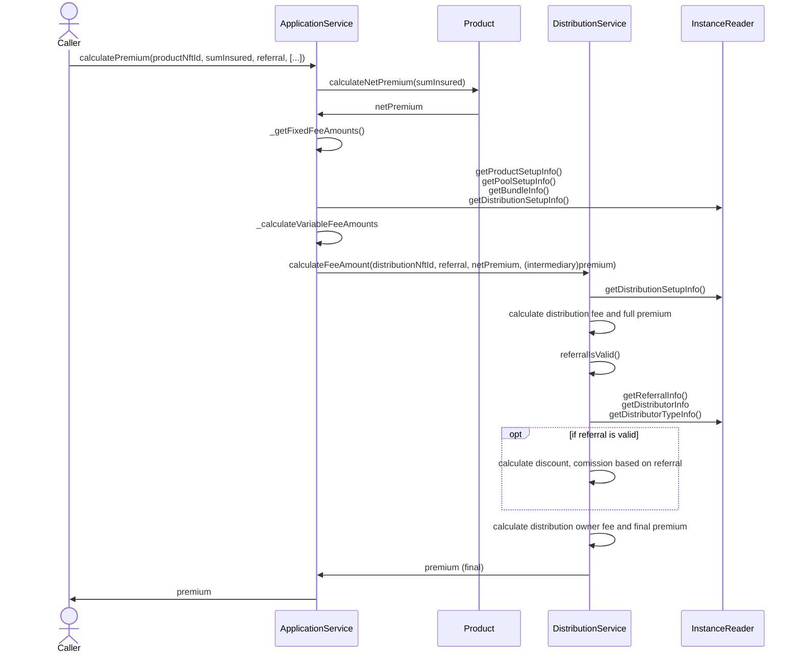

# ApplicationService sequences 

## calculatePremium

```mermaid
sequenceDiagram
    actor C as Caller
    participant AS as ApplicationService
    participant P as Product
    participant DS as DistributionService
    participant IR as InstanceReader
    
    C ->> AS: calculatePremium(productNftId, sumInsured, referral, [...])
    AS ->> P: calculateNetPremium(sumInsured)
    P ->> AS: netPremium
    AS ->> AS: _getFixedFeeAmounts()
    AS ->> IR: getProductSetupInfo()<br/> getPoolSetupInfo() <br/> getBundleInfo() <br/> getDistributionSetupInfo()
    AS ->> AS: _calculateVariableFeeAmounts
    AS ->> DS: calculateFeeAmount(distributionNftId, referral, netPremium, (intermediary)premium)
    DS ->> IR: getDistributionSetupInfo()
    DS ->> DS: calculate distribution fee and full premium
    DS ->> DS: referralIsValid()
    DS ->> IR: getReferralInfo()<br/> getDistributorInfo<br/> getDistributorTypeInfo()
    opt if referral is valid
        DS ->> DS: calculate discount, comission based on referral
    end
    DS ->> DS: calculate distribution owner fee  and final premium
    DS ->> AS: premium (final)
    AS ->> C: premium
```
