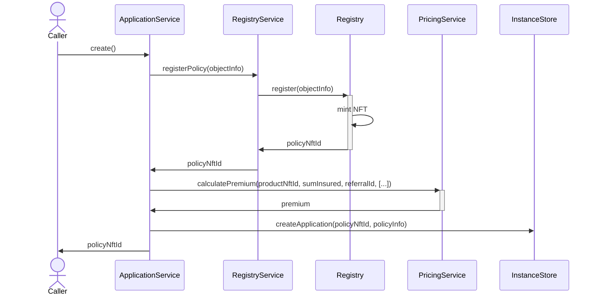

# ApplicationService sequences 

## create

```mermaid
sequenceDiagram
    actor C as Caller
    participant AS as ApplicationService
    participant RS as RegistryService
    participant R as Registry
    participant PS as PricingService
    participant IS as InstanceStore    
    
    C ->> AS: create()
    AS ->> RS: registerPolicy(objectInfo)
    RS ->> +R: register(objectInfo)
    R ->> R: mint NFT
    R ->> -RS: policyNftId
    RS ->> AS: policyNftId
    AS ->> +PS: calculatePremium(productNftId, sumInsured, referralId, [...])

    PS ->> -AS: premium
    AS ->> IS: createApplication(policyNftId, policyInfo)
    AS ->> C: policyNftId
```