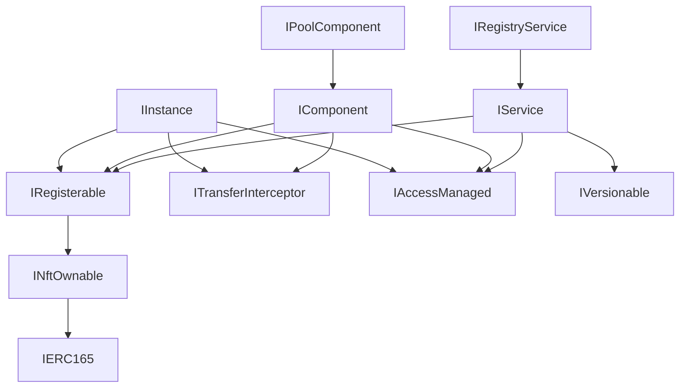

# Contract Intheritance

```mermaid
  graph TD
      IInstance --> IRegisterable
      IInstance --> ITransferInterceptor
      IInstance --> IAccessManaged
      IPoolComponent --> IComponent
      IComponent --> IRegisterable
      IComponent --> ITransferInterceptor
      IComponent --> IAccessManaged
      IRegistryService --> IService
      IService-->IRegisterable
      IService-->IVersionable
      IService-->IAccessManaged
      IRegisterable-->INftOwnable
      INftOwnable-->IERC165
```
