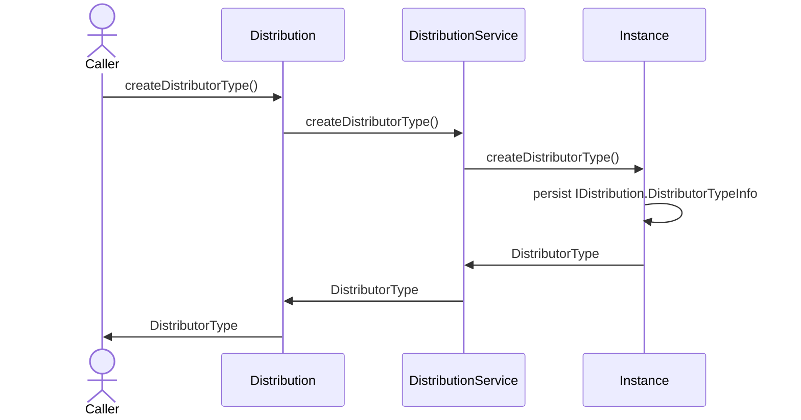
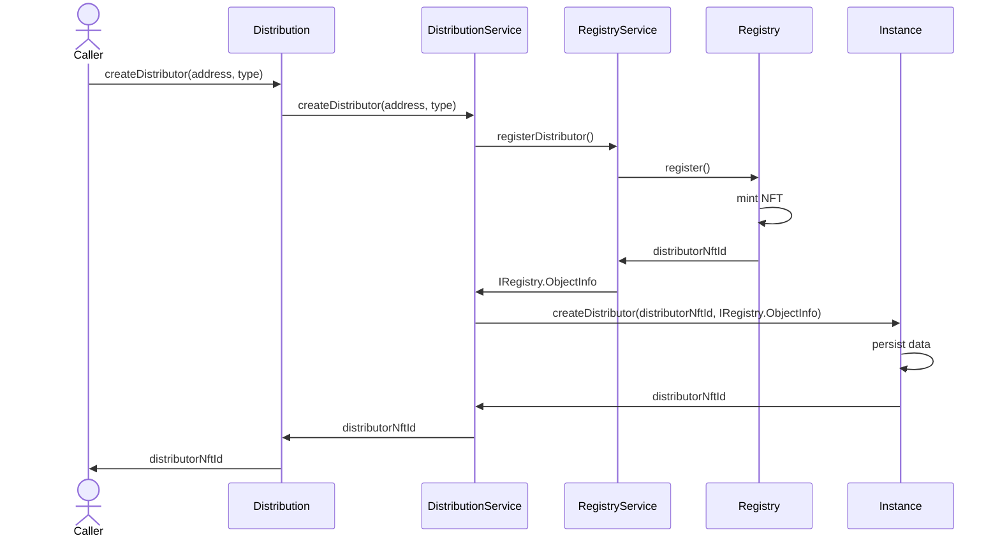
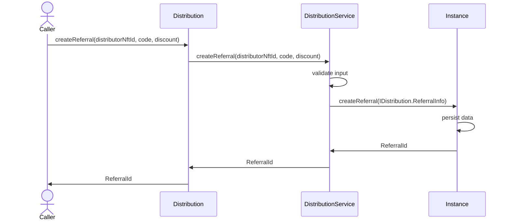
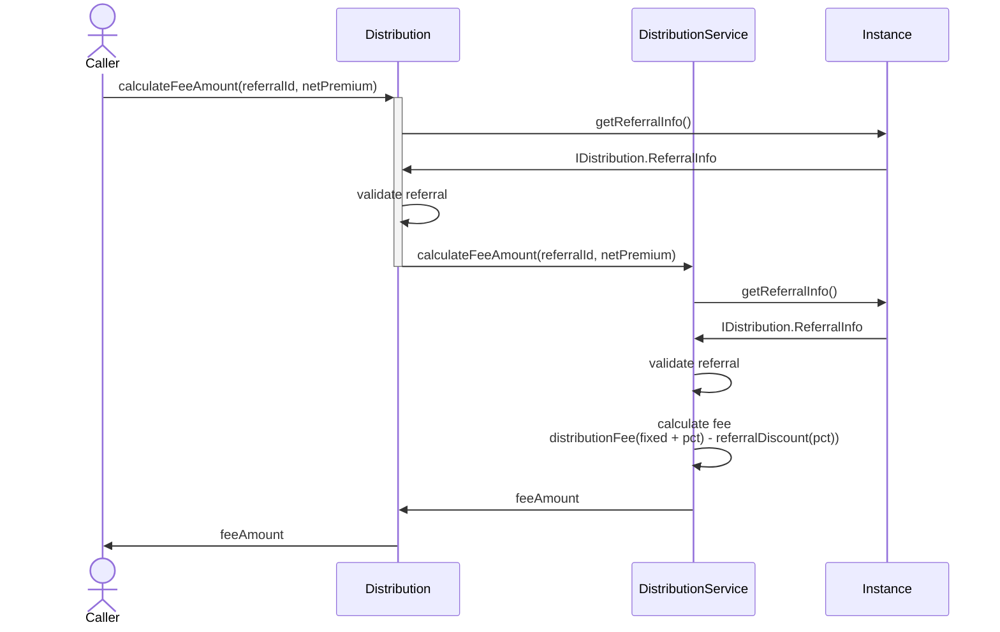
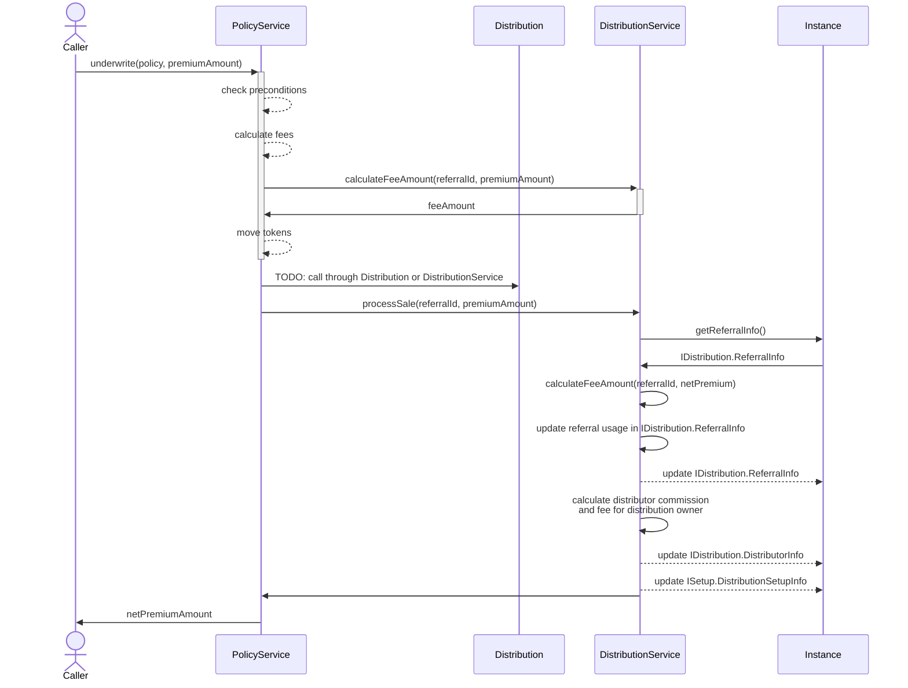

# Distribution / Referral sequences

## createDistributorType

```mermaid
sequenceDiagram
    actor C as Caller
    participant D as Distribution
    participant DS as DistributionService
    participant I as Instance
    
    C ->> D: createDistributorType()
    D ->> DS: createDistributorType()
    DS ->> I: createDistributorType()
    I ->> I: persist IDistribution.DistributorTypeInfo
    I ->> DS: DistributorType
    DS ->> D: DistributorType
    D ->> C: DistributorType
```

## createDistributor

```mermaid
sequenceDiagram
    actor C as Caller
    participant D as Distribution
    participant DS as DistributionService
    participant RS as RegistryService
    participant R as Registry
    participant I as Instance
    
    C ->> D: createDistributor(address, type)
    D ->> DS: createDistributor(address, type)
    DS ->> RS: registerDistributor()
    RS ->> R: register()
    R ->> R: mint NFT
    R ->> RS: distributorNftId
    RS ->> DS: IRegistry.ObjectInfo
    DS ->> I: createDistributor(distributorNftId, IRegistry.ObjectInfo)
    I ->> I: persist data
    I ->> DS: distributorNftId
    DS ->> D: distributorNftId
    D ->> C: distributorNftId
```

## createReferral

```mermaid
sequenceDiagram
    actor C as Caller
    participant D as Distribution
    participant DS as DistributionService
    participant I as Instance
    
    C ->> D: createReferral(distributorNftId, code, discount)
    D ->> DS: createReferral(distributorNftId, code, discount)
    DS ->> DS: validate input
    DS ->> I: createReferral(IDistribution.ReferralInfo)
    I ->> I: persist data
    I ->> DS: ReferralId
    DS ->> D: ReferralId
    D ->> C: ReferralId
```

## calculateFeeAmount

```mermaid
sequenceDiagram
    actor C as Caller
    participant D as Distribution
    participant DS as DistributionService
    participant I as Instance
    
    C ->> +D: calculateFeeAmount(referralId, netPremium)
    D ->> I: getReferralInfo()
    I ->> D: IDistribution.ReferralInfo
    D ->> D: validate referral
    D ->> -DS: calculateFeeAmount(referralId, netPremium)
    DS ->> I: getReferralInfo()
    I ->> DS: IDistribution.ReferralInfo
    DS ->> DS: validate referral
    DS ->> DS: calculate fee <br>distributionFee(fixed + pct) - referralDiscount(pct)) 
    DS ->> D: feeAmount
    D ->> C: feeAmount
```

## processSale

```mermaid
sequenceDiagram
    actor C as Caller
    participant PS as PolicyService
    participant D as Distribution
    participant DS as DistributionService
    participant I as Instance
    
    C ->> +PS: underwrite(policy, premiumAmount)
    PS -->> PS: check preconditions
    PS -->> PS: calculate fees
    PS ->> +DS: calculateFeeAmount(referralId, premiumAmount)
    DS ->> -PS: feeAmount
    PS -->> -PS: move tokens
    PS ->> D: TODO: call through Distribution or DistributionService
    PS ->> DS: processSale(referralId, premiumAmount)
    DS ->> I: getReferralInfo()
    I ->> DS: IDistribution.ReferralInfo
    DS ->> DS: calculateFeeAmount(referralId, netPremium)
    DS ->> DS: update referral usage in IDistribution.ReferralInfo
    DS -->> I: update IDistribution.ReferralInfo
    DS ->> DS: calculate distributor commission<br> and fee for distribution owner
    DS -->> I: update IDistribution.DistributorInfo
    DS -->> I: update ISetup.DistributionSetupInfo
    DS ->> PS: 
    PS ->> C: netPremiumAmount
```
