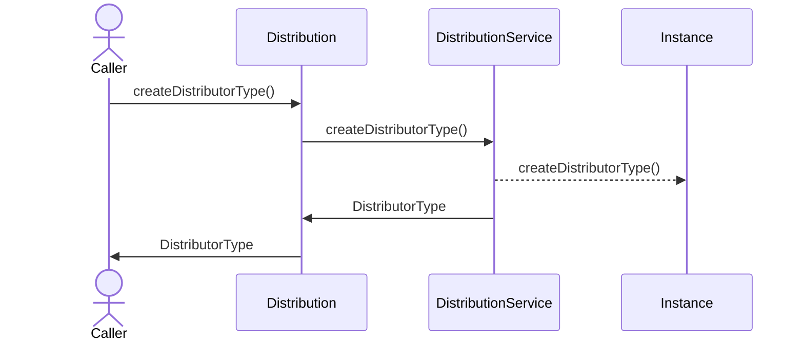
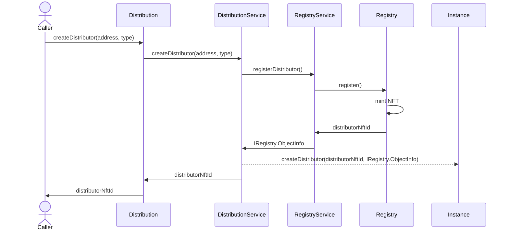
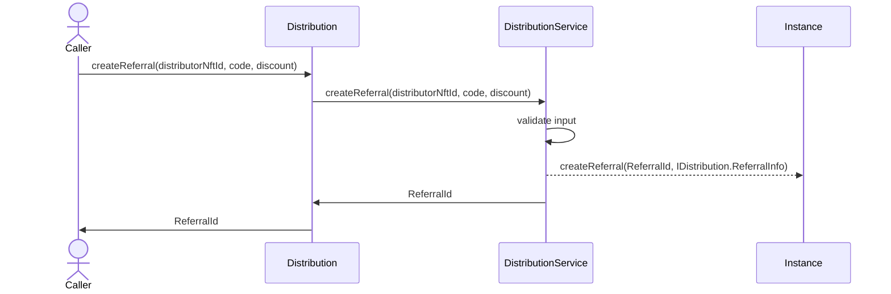
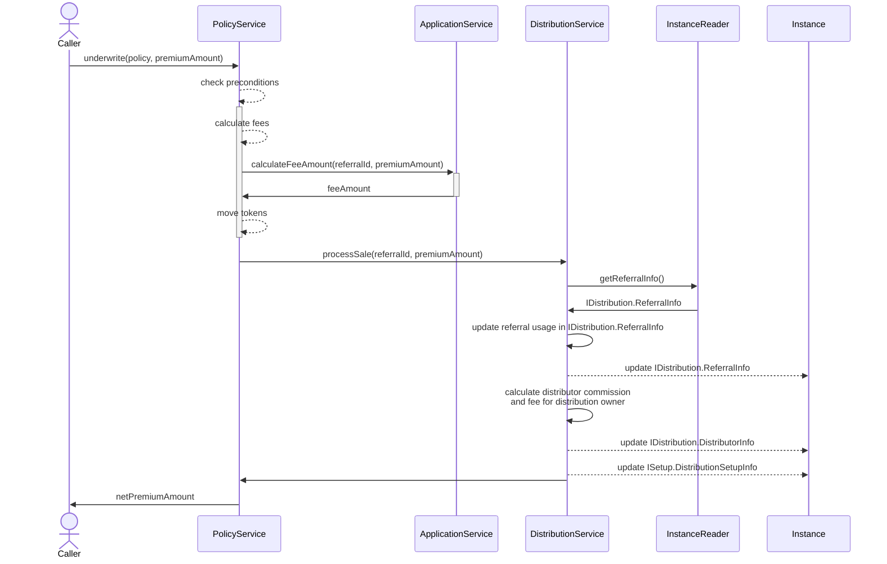

# DistributionService / Referral sequences

## createDistributorType

```mermaid
sequenceDiagram
    actor C as Caller
    participant D as Distribution
    participant DS as DistributionService
    participant I as Instance
    
    C ->> D: createDistributorType()
    D ->> DS: createDistributorType()
    DS -->> I: createDistributorType()
    DS ->> D: DistributorType
    D ->> C: DistributorType
```

## createDistributor

```mermaid
sequenceDiagram
    actor C as Caller
    participant D as Distribution
    participant DS as DistributionService
    participant RS as RegistryService
    participant R as Registry
    participant I as Instance
    
    C ->> D: createDistributor(address, type)
    D ->> DS: createDistributor(address, type)
    DS ->> RS: registerDistributor()
    RS ->> R: register()
    R ->> R: mint NFT
    R ->> RS: distributorNftId
    RS ->> DS: IRegistry.ObjectInfo
    DS -->> I: createDistributor(distributorNftId, IRegistry.ObjectInfo)
    DS ->> D: distributorNftId
    D ->> C: distributorNftId
```

## createReferral

```mermaid
sequenceDiagram
    actor C as Caller
    participant D as Distribution
    participant DS as DistributionService
    participant I as Instance
    
    C ->> D: createReferral(distributorNftId, code, discount)
    D ->> DS: createReferral(distributorNftId, code, discount)
    DS ->> DS: validate input
    DS -->> I: createReferral(ReferralId, IDistribution.ReferralInfo)
    DS ->> D: ReferralId
    D ->> C: ReferralId
```

## processSale

```mermaid
sequenceDiagram
    actor C as Caller
    participant PS as PolicyService
    participant AS as ApplicationService
    participant DS as DistributionService
    participant IR as InstanceReader
    participant I as Instance
    
    C ->> PS: underwrite(policy, premiumAmount)
    PS -->> +PS: check preconditions
    PS -->> PS: calculate fees
    PS ->> +AS: calculateFeeAmount(referralId, premiumAmount)
    AS ->> -PS: feeAmount
    PS -->> -PS: move tokens
    PS ->> DS: processSale(referralId, premiumAmount)
    DS ->> IR: getReferralInfo()
    IR ->> DS: IDistribution.ReferralInfo
    DS ->> DS: update referral usage in IDistribution.ReferralInfo
    DS -->> I: update IDistribution.ReferralInfo
    DS ->> DS: calculate distributor commission<br> and fee for distribution owner
    DS -->> I: update IDistribution.DistributorInfo
    DS -->> I: update ISetup.DistributionSetupInfo
    DS ->> PS: 
    PS ->> C: netPremiumAmount
```
