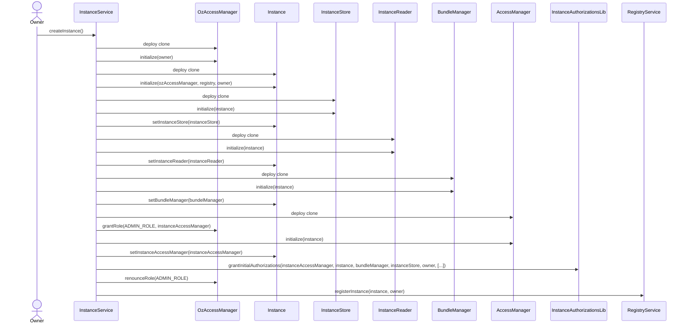

# InstanceService sequences

## createInstance

```mermaid
sequenceDiagram
    actor O as Owner
    participant IS as InstanceService
    participant OAM as OzAccessManager
    participant I as Instance
    participant IST as InstanceStore
    participant IR as InstanceReader
    participant BM as BundleManager
    participant IAM as AccessManager
    participant IAL as InstanceAuthorizationsLib
    participant RS as RegistryService
    
    O ->> IS: createInstance()
    IS ->> OAM: deploy clone
    IS ->> OAM: initialize(owner)
    IS ->> I: deploy clone
    IS ->> I: initialize(ozAccessManager, registry, owner) 
    IS ->> IST: deploy clone 
    IS ->> IST: initialize(instance)
    IS ->> I: setInstanceStore(instanceStore)
    IS ->> IR: deploy clone 
    IS ->> IR: initialize(instance)
    IS ->> I: setInstanceReader(instanceReader)
    IS ->> BM: deploy clone 
    IS ->> BM: initialize(instance)
    IS ->> I: setBundleManager(bundelManager)
    IS ->> IAM: deploy clone
    IS ->> OAM: grantRole(ADMIN_ROLE, instanceAccessManager)
    IS ->> IAM: initialize(instance)
    IS ->> I: setInstanceAccessManager(instanceAccessManager)
    IS ->> IAL: grantInitialAuthorizations(instanceAccessManager, instance, bundleManager, instanceStore, owner, [...])
    IS ->> OAM: renounceRole(ADMIN_ROLE)
    IS ->> RS: registerInstance(instance, owner)
```
