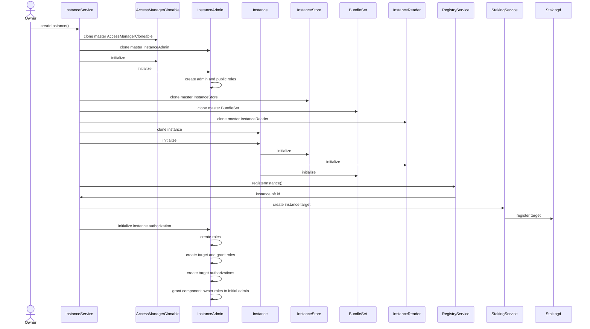

# InstanceService sequences

## createInstance

```mermaid
sequenceDiagram
    actor O as Owner
    participant IS as InstanceService
    participant ACM as AccessManagerClonable
    participant IADM as InstanceAdmin
    participant I as Instance
    participant IST as InstanceStore
    participant BS as BundleSet
    participant IR as InstanceReader
    participant RS as RegistryService
    participant SS as StakingService
    participant S as Stakingd
    
    O ->> IS: createInstance()
    IS ->> ACM: clone master AccessManagerCloneable
    IS ->> IADM: clone master InstanceAdmin
    IS ->> ACM: initialize
    IS ->> IADM: initialize
    IADM ->> IADM: create admin and public roles
    IS ->> IST: clone master InstanceStore
    IS ->> BS: clone master BundleSet
    IS ->> IR: clone master InstanceReader
    IS ->> I: clone instance
    IS ->> I: initialize
    I ->> IST: initialize
    I ->> IR: initialize
    I ->> BS: initialize
    IS ->> RS: registerInstance()
    RS ->> IS: instance nft id
    IS ->> SS: create instance target
    SS ->> S: register target
    IS ->> IADM: initialize instance authorization
    IADM ->> IADM: create roles
    IADM ->> IADM: create target and grant roles
    IADM ->> IADM: create target authorizations
    IADM ->> IADM: grant component owner roles to initial admin
```
