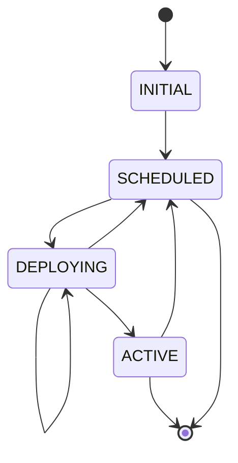
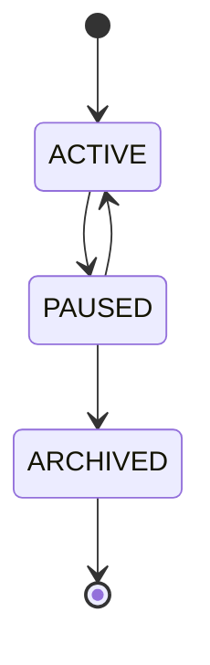
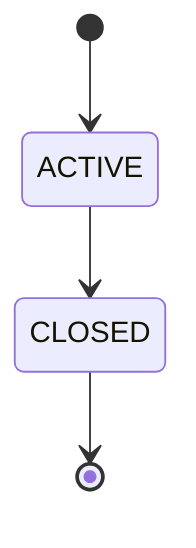
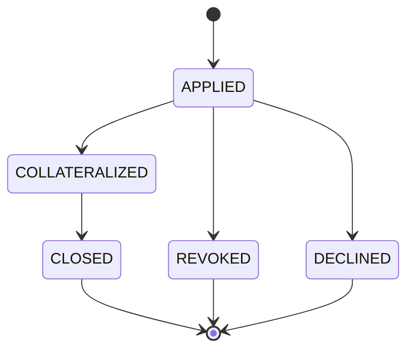
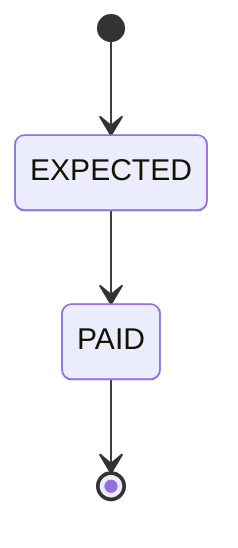
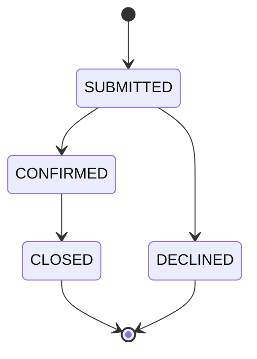
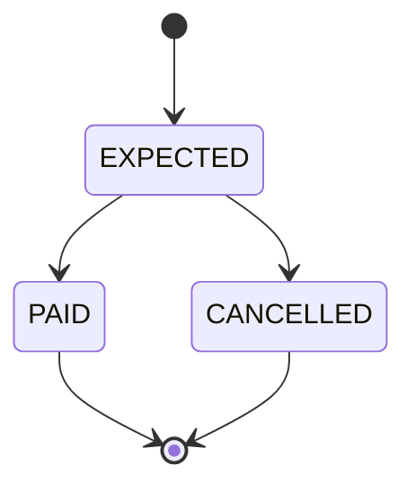
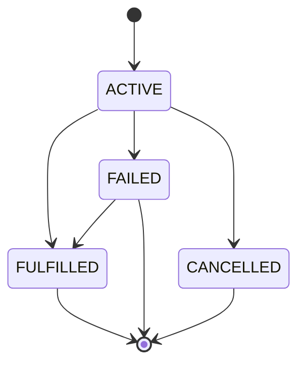

# Lifecycle

## Release lifecycle

## Component lifecycle

## Bundle lifecycle

## Policy lifecycle

## Premium lifecycle

# Claim lifecycle

# Payout lifecycle

# Risk lifecycle

# Request lifecycle

