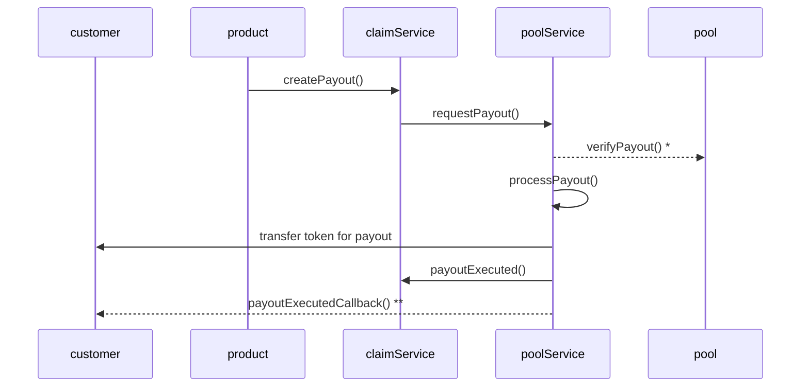
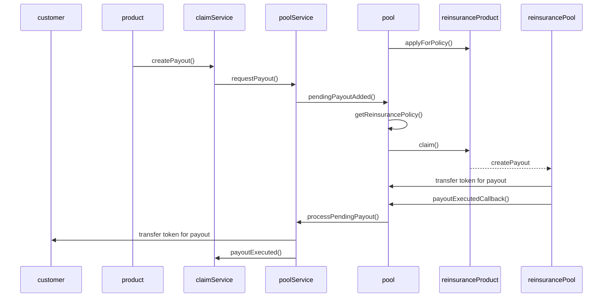

# Payout Handling

Pool specifies **retention level**.
Retention level defines up to which percentage of the sum insured the pool is payout out using its own/current funds.
Depending on the amount of a new payout the poolService decides to either execute the payout directly or to add the payout as a pending payout with a notification of the pool.

The sequence below sketches the small payout flow (payout < retention amount)
- retention level: 30%
- sum insured: 1000
- payout: 200

*: if pool is configured to verify payouts before execution

**: callback only if customer is contract (IPolicyHolder)

The sequence below sketches the call flow for payouts larger than the retention amount
- retention level: 30%
- sum insured: 1000
- payout: 500
  * locally available: 300
  * via policy (re-insurance): 200

