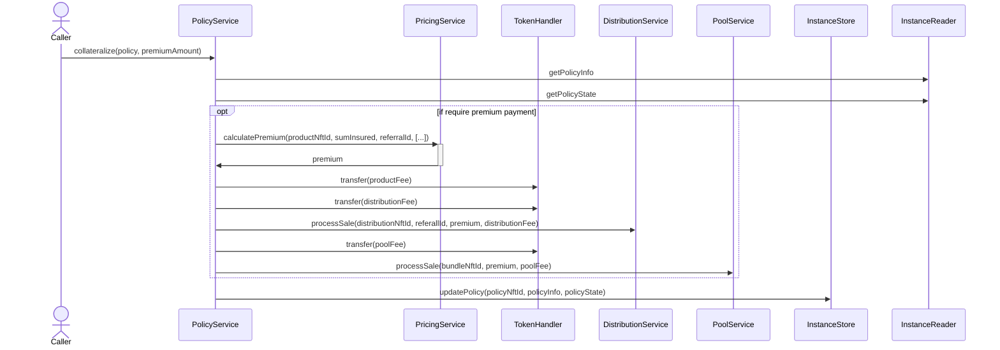

# PolicyService sequences

## collateralize

```mermaid
sequenceDiagram
    actor C as Caller
    participant PS as PolicyService
    participant PRS as PricingService
    participant TH as TokenHandler
    participant DS as DistributionService
    participant POS as PoolService
    participant IS as InstanceStore
    participant IR as InstanceReader
    
    C ->> PS: collateralize(policy, premiumAmount)
    PS ->> IR: getPolicyInfo
    PS ->> IR: getPolicyState
    opt if require premium payment
        PS ->> +PRS: calculatePremium(productNftId, sumInsured, referralId, [...])
        PRS ->> -PS: premium
        PS ->> TH: transfer(productFee)
        PS ->> TH: transfer(distributionFee)
        PS ->> DS: processSale(distributionNftId, referallId, premium, distributionFee)
        PS ->> TH: transfer(poolFee)
        PS ->> POS: processSale(bundleNftId, premium, poolFee)
    end
    PS ->> IS: updatePolicy(policyNftId, policyInfo, policyState)
```