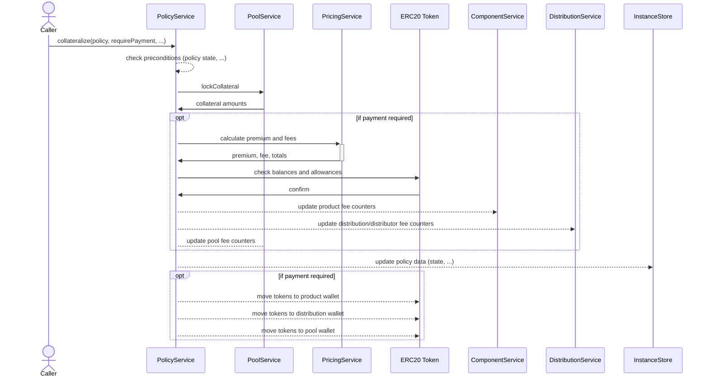

# PolicyService sequences

## collateralize

```mermaid
sequenceDiagram
    actor C as Caller
    participant PS as PolicyService
    participant POS as PoolService
    participant PRS as PricingService
    participant TO as ERC20 Token
    participant CS as ComponentService
    participant DS as DistributionService
    participant IS as InstanceStore
    
    C ->> PS: collateralize(policy, requirePayment, ...)
    PS -->> +PS: check preconditions (policy state, ...)
    PS ->> POS: lockCollateral
    POS ->> PS: collateral amounts
    opt if payment required
        PS ->> +PRS: calculate premium and fees
        PRS ->> -PS: premium, fee, totals
        PS ->> TO: check balances and allowances
        TO ->> PS: confirm
        PS -->> CS: update product fee counters
        PS -->> DS: update distribution/distributor fee counters
        PS --> POS: update pool fee counters
    end
    PS -->> IS: update policy data (state, ...)
    opt if payment required
        PS -->> TO: move tokens to product wallet
        PS -->> TO: move tokens to distribution wallet
        PS -->> TO: move tokens to pool wallet
    end
```
