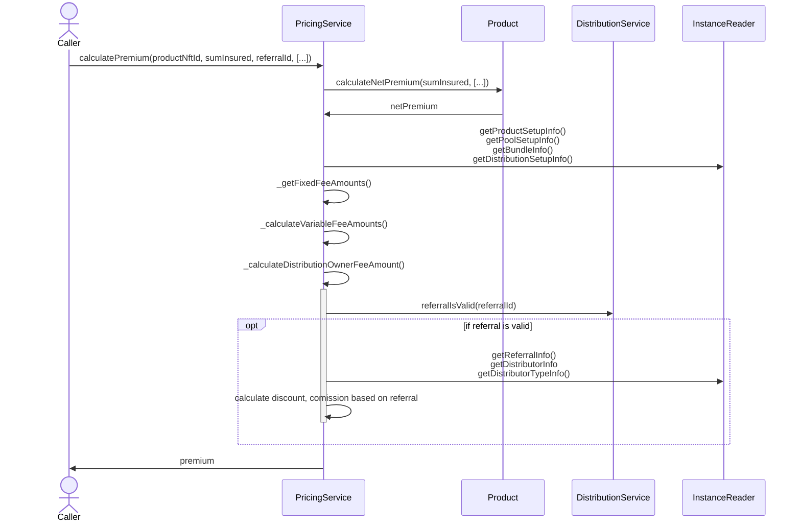

# PricingService sequences 

## calculatePremium

```mermaid
sequenceDiagram
    actor C as Caller
    participant PS as PricingService
    participant P as Product
    participant DS as DistributionService
    participant IR as InstanceReader  
    
    C ->> PS: calculatePremium(productNftId, sumInsured, referralId, [...])
    PS ->> P: calculateNetPremium(sumInsured, [...])
    P ->> PS: netPremium
    PS ->> IR: getProductSetupInfo()<br/> getPoolSetupInfo() <br/> getBundleInfo() <br/> getDistributionSetupInfo()
    PS ->> PS: _getFixedFeeAmounts()
    PS ->> PS: _calculateVariableFeeAmounts()
    PS ->> +PS: _calculateDistributionOwnerFeeAmount()
    PS ->> DS: referralIsValid(referralId)
    opt if referral is valid
        PS ->> IR: getReferralInfo()<br/> getDistributorInfo<br/> getDistributorTypeInfo()
        PS ->> -PS: calculate discount, comission based on referral
    end
    PS ->> C: premium
```
