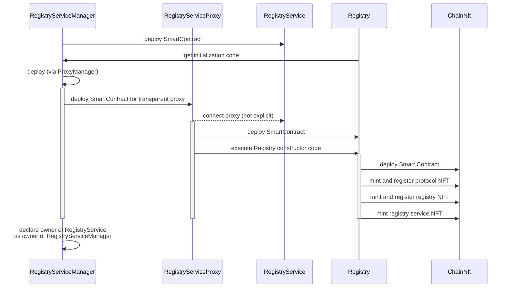

```mermaid
sequenceDiagram
    participant RSM as RegistryServiceManager
    participant PRS as RegistryServiceProxy
    participant RS as RegistryService
    participant R as Registry
    participant NFT as ChainNft
    
    RSM ->> RS: deploy SmartContract
    R ->> RSM: get initialization code
    RSM ->> RSM: deploy (via ProxyManager)
    activate RSM
    RSM ->> PRS: deploy SmartContract for transparent proxy
    PRS -->> RS: connect proxy (not explicit)
    activate PRS
    PRS ->> R: deploy SmartContract
    PRS ->> R: execute Registry constructor code
    activate R
    R ->> NFT: deploy Smart Contract
    R ->> NFT: mint and register protocol NFT
    R ->> NFT: mint and register registry NFT
    R ->> NFT: mint registry service NFT
    deactivate R
    deactivate RSM
    deactivate PRS
    RSM ->> RSM: declare owner of RegistryService<br/>as owner of RegistryServiceManager


```